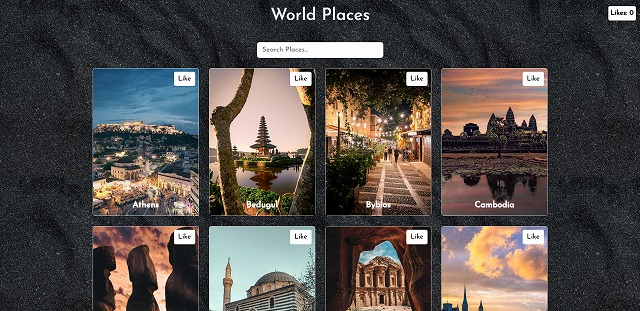

[](https://classroom.github.com/a/so4zIuuG)
## World Places Photos



## Vercel Link

- The App is deployed here: https://worldplaces-photos.vercel.app/

## Installation

```bash
git clone https://github.com/revou-fsse-1/w18-react-page-rioyulinanda.git

```

```bash
cd w18-react-page-rioyulinanda
```

```bash
pnpm install
```

```bash
pnpm dev
```

```bash
then it can be accessed through http://localhost:5173/

```
